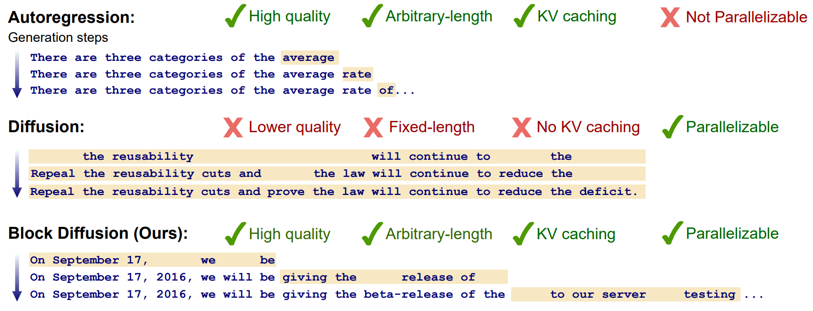
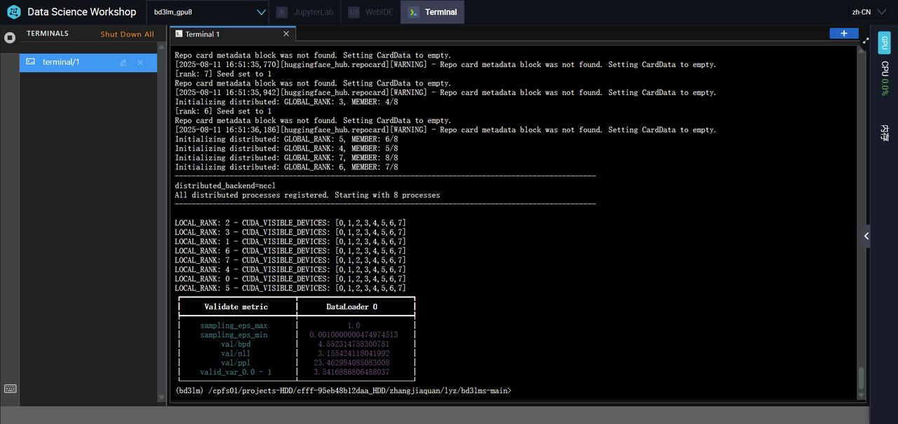
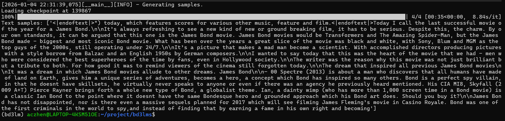
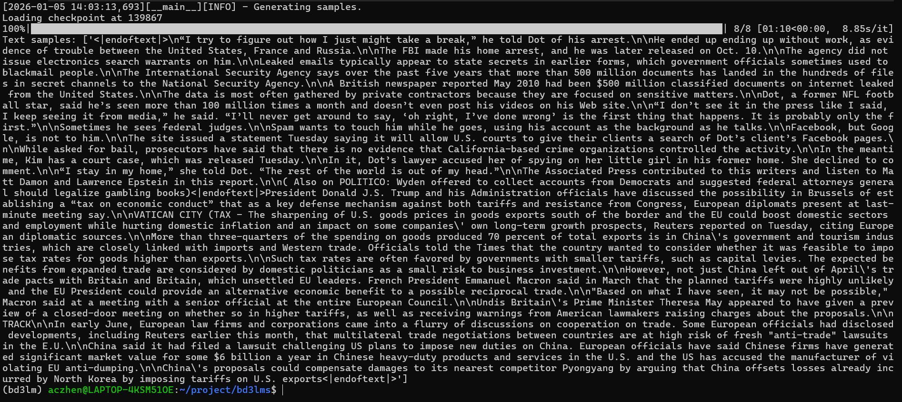
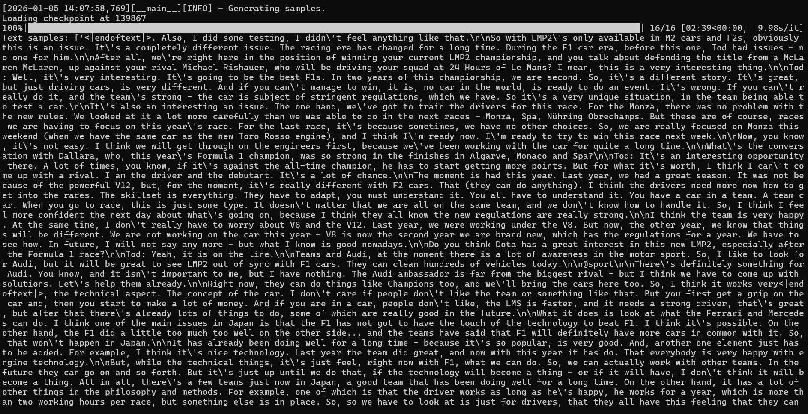

# [Block Diffusion: Interpolating Between Autoregressive and Diffusion Language Models](https://arxiv.org/abs/2503.09573) (ICLR 2025 Oral)

 
 
## 项目简介
该项目是“块扩散语言模型（Block Diffusion Language Model）”，是扩散语言模型家族的核心成员之一。扩散语言模型作为文本生成模型的重要成员，近年来取得了飞速的发展。相比自回归语言模型，扩散语言模型具**并行生成**、**双向上下文**、**更好的可控生成性**以及**迭代细化**等优势，是一个非常值得研究的领域。***块扩散语言模型***通过在自回归语言模型和扩散语言模型之间插值（块间是自回归分布，而块内执行扩散），在生成质量和速度上相比之前的扩散语言模型都有显著提高。


## 略作扩展
我在原项目基础上略作扩展：块扩散语言模型块间是自回归分布，也就是说按块生成文本，而在生成每个块时，遵循扩散语言范式。那么块的大小就很重要，我们需要在自回归的优势和扩散的优势之间进行权衡，选取合适的块大小，以满足高质量、快速的文本生成任务。块的大小（block_size）是我们在训练的时候确定的，作者只开源（或者说是只训练）了block_size = 4, 8 ,16 的模型权重（checkpoints），而4，8，16个token甚至无法容纳一句话的长度（特别是在中文的情况下），由于研究任务需要block_size = 128的模型权重，所以我调整了一些训练参数，在**一台有 8 张 A100（80G显存）显卡的服务器上并行训练了两周**，成功训练出块大小为128的模型权重，**并在PPL等测评指标上达到了预期效果**（如下图所示）。 

 


## 运行项目
* **配置环境**
  
  1、创建虚拟环境
  ```bash
  conda create --name bd3lm python=3.9
  ```
  
  2、激活虚拟环境
  ```bash
  conda activate bd3lm
  ```
  
  3、安装环境依赖
  ```bash
  pip install -r requirements.txt
  ```
  
* **生成文本**

  1、进入目录bd3lms
  ```bash
  cd */bd3lms
  ```
  
  2、下载checkpoints
  
  由于GitHub的repo不支持上传大于25MB的文件，所以我将训练好的块大小为128的checkpoints上传Hugging Face 🤗:
[best_128_en.ckpt](https://huggingface.co/ACzhen/best_128_en.ckpt/tree/main) ，请从这个链接中下载模型权重。
  然后在bd3lms目录下创建文件夹checkpoints，并把下载好的模型权重放到checkpoints文件夹中。
  ```bash
  mkdir checkpoints
  ```

  3、安装依赖
  ```bash
  pip install -r requirements.txt
  ```

  4、运行脚本
  ```bash
  bash scripts/var_len/varlen_bd3lm.sh
  ```
  运行脚本后结果会打印在终端中，并且也会保存在bd3lms/varlen_sample_logs目录下。

* **效果展示**
  我们通过调整脚本中的SEED和LENGTH来控制文本生成内容和长度。
  
  1、SEED=3 LENGTH=512
  
  
  
  2、SEED=2 LENGTH=1024
  
  
  
  3、SEED=1 LENGTH=2048
  
  


## Citation
```
@inproceedings{
arriola2025block,
title={Block Diffusion: Interpolating Between Autoregressive and Diffusion Language Models},
author={Marianne Arriola and Aaron Gokaslan and Justin T Chiu and Zhihan Yang and Zhixuan Qi and Jiaqi Han and Subham Sekhar Sahoo and Volodymyr Kuleshov},
booktitle={The Thirteenth International Conference on Learning Representations},
year={2025},
url={https://arxiv.org/abs/2503.09573}
}
```
